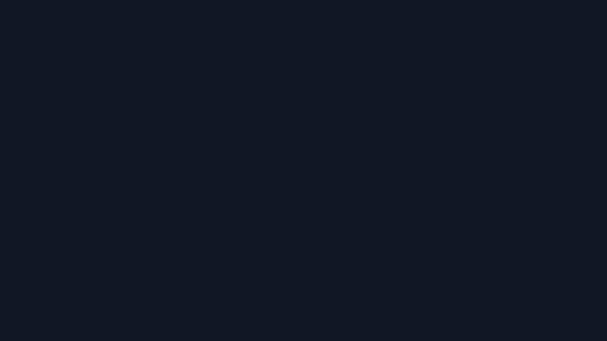

# QR Studio

**QR codes that actually scan, designed in seconds, nothing leaves your device.**

**Live:** https://qr-studio-jagpreet-singh1.vercel.app · **Studio:** https://qr-studio-jagpreet-singh1.vercel.app/studio

Designed and built by **[Jagpreet Singh](https://github.com/jagpreetsingh02)** for **GDG on Campus SRM** — Technical Recruitment 2026-27, Frontend Task 1 (QR Code Generator & Designer).

[](docs/demo.mp4)

The full 28-second demo plays above on a loop. [Open the MP4](docs/demo.mp4) for full quality.

[Watch the demo on Google Drive](https://drive.google.com/file/d/1R6lr0qqIxEHIW23eJI9QF7asXVheDxEw/view?usp=drive_link)

| Landing | Studio |
| --- | --- |
|  |  |
| **Photo QR, dark theme** | **Photo QR on mobile** |
|  |  |

More in [docs/screenshots/](docs/screenshots/). All screenshots and test photos are synthetic
images drawn by [`tests/fixtures.mjs`](tests/fixtures.mjs); no personal photos are used.

## Features

- **Five QR types:** URL, Text, Email, Phone and Wi-Fi, each with its own draft so switching never
  loses input. Payloads are encoded to spec and shown before you download:

  | Type | Encoded as |
  | --- | --- |
  | URL | `https://…` (scheme added when missing, otherwise many scanners show plain text) |
  | Email | `mailto:a@b.com?subject=Hello%20GDG` (`%20`, not `+`) |
  | Phone | `tel:+919876543210` (spaces and brackets stripped) |
  | Wi-Fi | `WIFI:T:WPA;S:GDG-Campus;P:build\;with\;gdg;;` (`\ ; , : "` escaped) |

- **Live preview and design:** size 128–1024 px, foreground and background (picker or hex, swap),
  error correction L/M/Q/H, quiet zone 0–10 modules, 8 presets that render the real code, and a
  centre logo with an automatic plate.
- **Scan check:** measured readings (WCAG contrast, quiet zone, size, error-correction recovery)
  with severity-ranked advice. It warns and never blocks a download.
- **Photo QR:** add a photo under **Design → Photo** and pick a blend:
  - **Dots** (default, halftone): every data module keeps its value as a dot at the module centre,
    which is where a decoder samples, so the photo shows everywhere else. Corner eyes sit on a light
    plate; timing and alignment patterns stay solid; no data module is ever skipped. You can tune dot
    size and shape, halo, eye plate, border and Detail (QR version).
  - **Tinted:** each dark module takes the photo's colour, darkened until it contrasts.
  - **Underlay:** the photo sits behind a standard code.

  Error correction is at least Q while a photo is set. Every render is test-scanned in the browser;
  on a fail, **Boost readability** steps the settings up until it decodes, or restores your
  settings and says the photo is too busy. Removing the photo restores the exact original render.
- **Downloads:** PNG exported from the preview canvas itself (pixel-identical), SVG from the same
  geometry (vector dots over the embedded photo), and copy-to-clipboard.
- **Recent codes:** the last 12 codes survive a refresh and restore both content and design, with
  remove and clear-all undo.
- **Private by construction:** no backend. Payloads never go in the URL, the Wi-Fi password is
  masked on screen, and images are processed and stored only on this device (IndexedDB).
- **Accessible and responsive:** WCAG 2.2 AA contrast in both themes, full keyboard support
  (⌘/Ctrl + Enter downloads), `prefers-reduced-motion` honoured, light and dark themes, and layouts
  for desktop, tablet and mobile.

**Upload limits**

| | Accepted | Size limit | Stored as |
| --- | --- | --- | --- |
| Photo | PNG, JPG, WebP, GIF, AVIF | 25 MB | JPEG, longest edge ≤ 2048 px |
| Logo | PNG, JPG, WebP, GIF, AVIF; SVG | 10 MB; SVG 2 MB | PNG, longest edge ≤ 1024 px |

HEIC, wrong types, oversize and corrupt files each get a specific message. SVG logos are only
drawn through an `` and rasterised, never injected into the page, so scripts in them cannot run.

## Tech stack

| Layer | Choice |
| --- | --- |
| Framework | React 19 + TypeScript |
| Build | Vite 8 |
| QR encoding | [`qrcode`](https://www.npmjs.com/package/qrcode) for the module matrix only; all drawing is my own renderer |
| Motion | [`motion`](https://motion.dev), loaded lazily |
| Styling | Hand-written CSS on generated design tokens ([docs/DESIGN.md](docs/DESIGN.md)) |
| Testing | Playwright, with jsQR and ZBar as decoders |
| Hosting | Vercel (static; [`vercel.json`](vercel.json) rewrites deep links to `index.html`) |

## Run locally

Requires Node 20.19+ or 22.12+.

```bash
npm install
npm run dev        # http://localhost:5173
npm run build      # type-check, then build to dist/
npm run lint
npm run test:e2e   # builds, serves dist/ and runs the 152 browser checks
```

## Testing

[`tests/e2e.mjs`](tests/e2e.mjs) runs **152 checks** in Chromium against a real build. "It scans"
is proven rather than assumed: rendered canvases and downloaded files are decoded and compared with
the expected payload. The suite covers every type and its validation, customisation, PNG/SVG
downloads, logos, recent codes, themes, keyboard use, no horizontal overflow at 375, 834 and
1440 px, no console errors, and the photo QR flow (upload limits, error correction, exports, local
storage, restore). Set `E2E_URL` to run it against any deployed copy.

Photo QR decode results: 3 test photos × 5 payload types at default settings, read by two decoders.

| Output size | jsQR | ZBar | Notes |
| --- | --- | --- | --- |
| 640 px | 15 / 15 | 14 / 15 | The miss (bands × Email) decodes with ZBar after raising Dot size to 55% |
| 320 px (default) | 15 / 15 | 7 / 15 | ZBar misses URL, Email and most Phone codes: dots are ~3.5 px |

**Lighthouse** (mobile): 99 performance, 100 accessibility, 100 best practices and 100 SEO on both
`/` and `/studio`, measured on 4 October 2026 on the production domain. The `.vercel.app` live link
above carries Vercel's automatic noindex header, so SEO reads lower there.

**Bundle:** the landing page's initial JS is 264 KiB (85.5 KiB gzipped); the studio (48 KiB, 15.5 KiB
gzipped), the photo engine and the decoder load only when needed.

## Honest limitations

- **Photo QR does not "always scan".** Busy photos, long content and small sizes all cost
  reliability. A deliberately hard photo (an 8 px checkerboard) fails at default settings until
  Boost readability fixes it.
- **Small sizes.** At the default 320 px, ZBar misses most longer codes (see the table). The app
  warns when dots fall under about 5 px; export at 640 px or more for print.
- **Phone cameras were not part of the automated run.** A phone reading a print in poor light is
  harder than a decoder reading pixels, so test the printed code.
- History keeps 12 codes, and its images live in this browser only, so they don't follow you to
  another device.
- Without a photo, modules are square: there are no gradients, custom module or eye shapes, frames
  or templates yet.
- QR Studio generates codes; it does not read them with a camera.

## Credits and research

- The halftone approach follows **Chu, Chang, Lee and Mitra, "Halftone QR Codes", ACM SIGGRAPH Asia
  2013 (ACM Transactions on Graphics 32(6))**: a decoder only samples the centre of each module, so
  the rest of the module can carry an image.
- **kloet.net**'s photo QR experiments were visual inspiration for the dots look.
- Everything here is my own implementation from those ideas. No code, images, icons or other assets
  were copied from those works or from any QR-styling product or library; the only QR dependency is
  `qrcode`, used for its module matrix.

## About me

I'm **Jagpreet Singh** ([@jagpreetsingh02](https://github.com/jagpreetsingh02)). I built QR Studio
for the GDG on Campus SRM Technical Recruitment 2026-27, and I tried to treat it as a real product
rather than a task: every claim on the landing page is something the app can prove, every "it
scans" is checked by a decoder in the test suite, and the limitations above are written as I
measured them.

If I keep going, the next steps are the ones I planned but did not start before the deadline:
custom module and eye shapes, gradients, frames with captions, and a template gallery, each
behind the same rule that the scan check has to keep passing.

---

Independent project by Jagpreet Singh. Not affiliated with or endorsed by Google.
