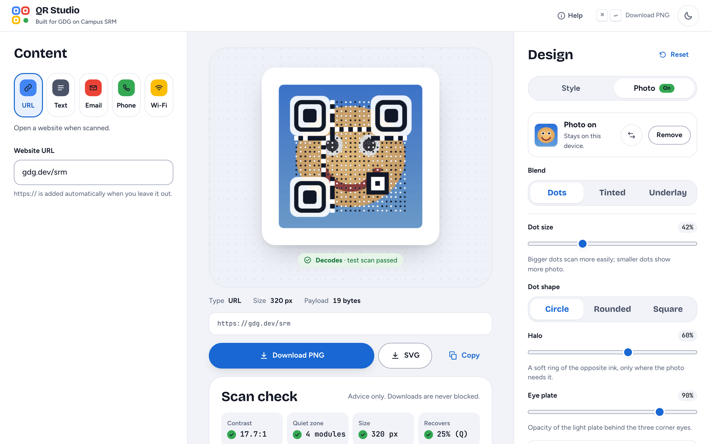
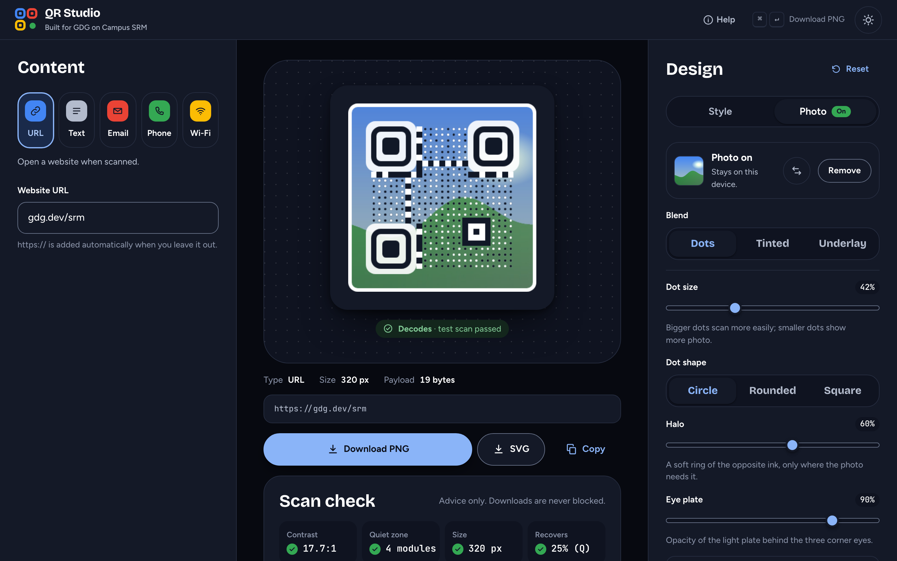
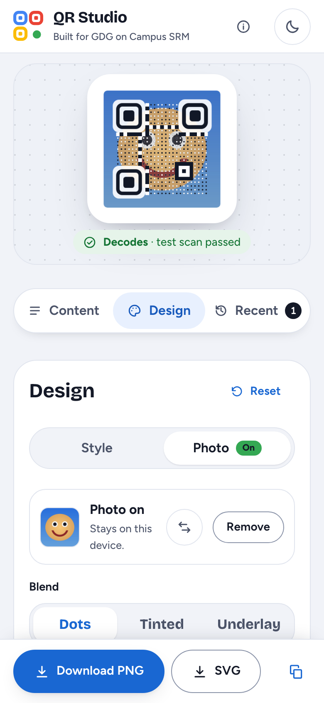
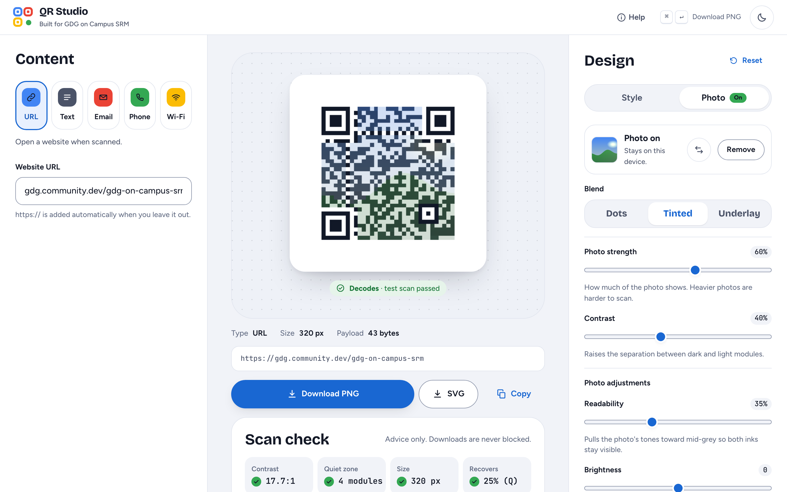
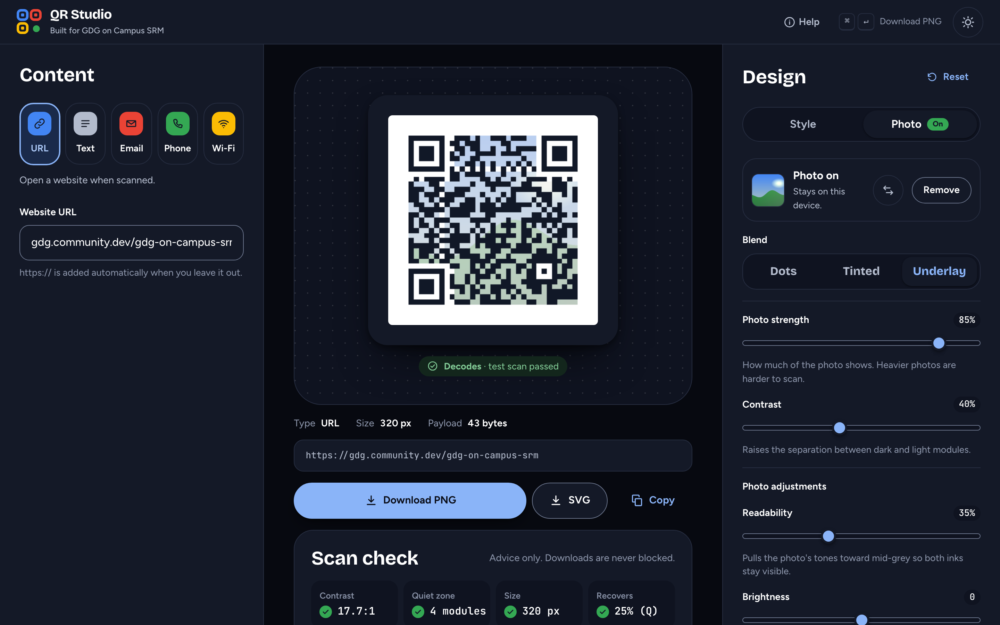
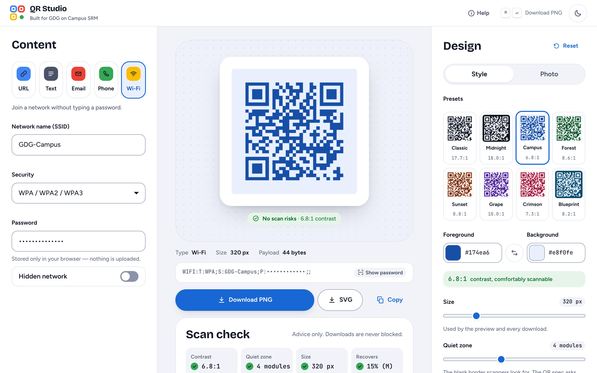
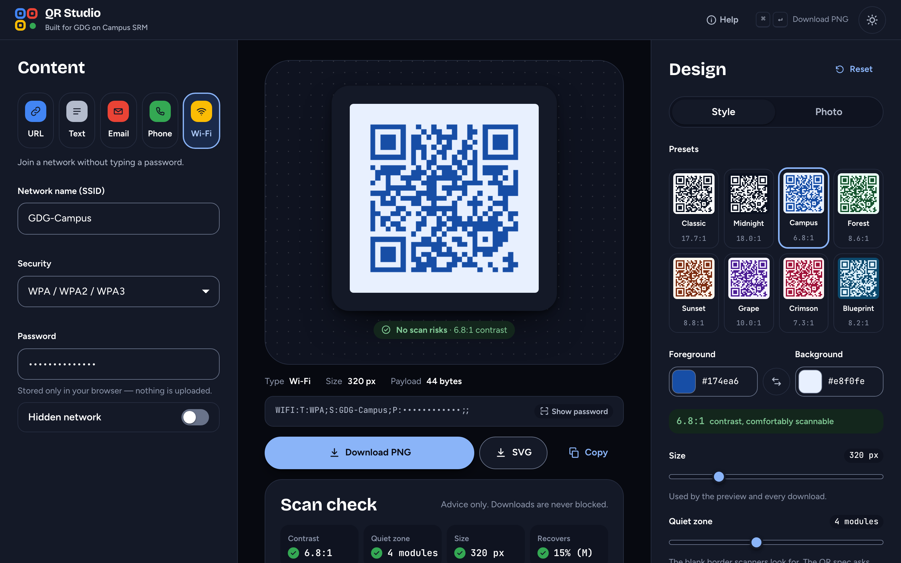
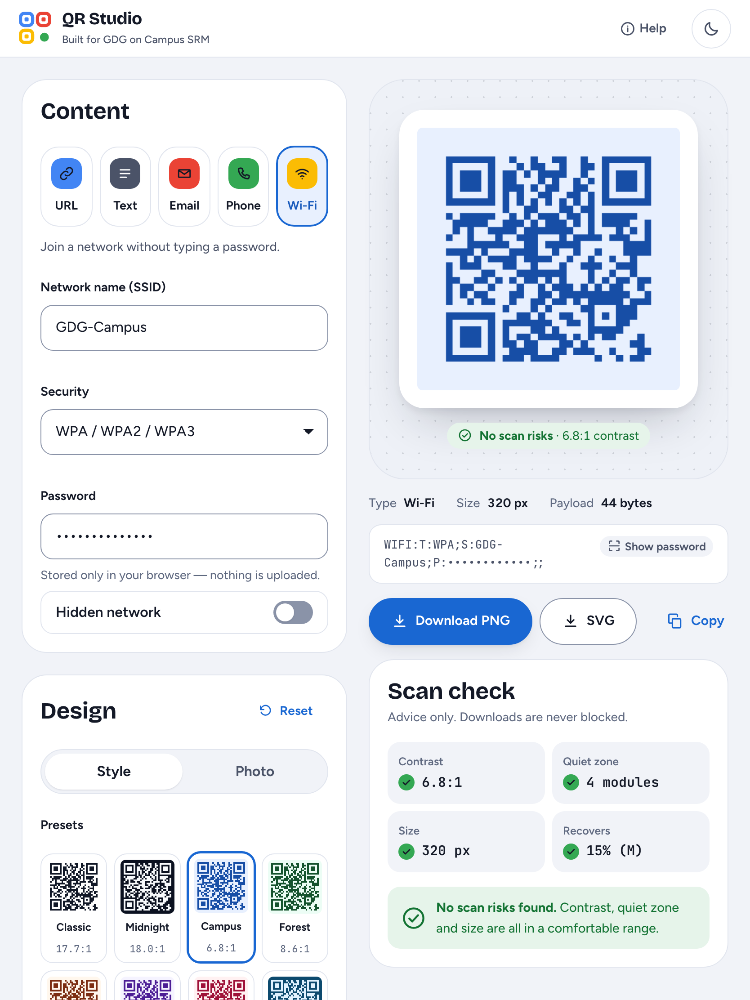
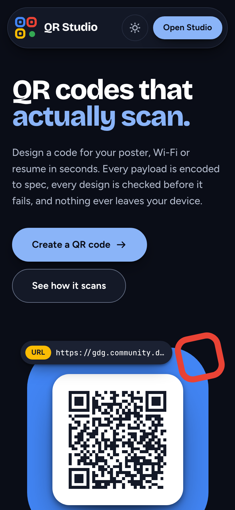

# QR Studio

**QR codes that actually scan, designed in seconds, nothing leaves your device.**

**Live:** https://qr-studio-jagpreet-singh1.vercel.app · **Studio:** https://qr-studio-jagpreet-singh1.vercel.app/studio

Designed and built by **[Jagpreet Singh](https://github.com/jagpreetsingh02)** for **GDG on Campus SRM** — Technical Recruitment 2026-27, Frontend Task 1 (QR Code Generator & Designer).


**28-second motion tour:** [public/demo/qr-studio-demo.mp4](public/demo/qr-studio-demo.mp4) (also on the landing page).

---

## What it is

QR Studio is a browser-only QR code generator and designer. It has two routes:

- **`/` — the landing page.** Explains the product by demonstrating it: a live hero code that
  morphs between payloads, a 28-second motion tour, a types showcase that prints the exact encoded
  string, a Photo QR showcase of real codes (each one decodes), a scan-check demo driven by the real
  advisor, and a privacy explainer.
- **`/studio` — the tool.** Pick a type, fill it in, design it, read the scan check, download.

There is no backend. Every payload is encoded and every image is rendered in the tab, which
matters because one of the types carries a Wi-Fi password.

## Features

### The required scope

| Requirement | How QR Studio handles it |
| --- | --- |
| 5 QR types | URL, Text, Email, Phone, Wi-Fi, each with its own draft so switching never loses input |
| Live preview | Re-renders on every valid change; the preview canvas is the PNG you download |
| Customisation | Size (128–1024 px), foreground/background (picker or hex, swap), error correction L/M/Q/H, quiet zone 0–10 modules |
| Presets | 8 presets that render the *actual* code in each palette; everything stays editable afterwards |
| PNG download | Exported from the preview canvas itself, so it matches pixel for pixel |
| Validation | Per-type, plain-language messages that replace the hint in place (no layout jump) |
| Scan reliability | Measured readings (WCAG contrast, quiet zone, size, recovery) plus severity-ranked advice; warns, never blocks |
| Recent codes | Saved to `localStorage`, survive refresh, restore content **and** design; remove/clear with undo |
| Responsive | Desktop three-column workspace, tablet two-column, mobile with a pinned preview and sticky export bar |
| Testing | 110 automated browser checks, committed (`npm run test:e2e`) |
| Deployment | Vercel |

### Correct payloads, shown not told

| Type | Encoded as |
| --- | --- |
| URL | `https://…` (scheme added when missing, otherwise many scanners show plain text) |
| Email | `mailto:a@b.com?subject=Hello%20GDG` (`%20`, not `+`) |
| Phone | `tel:+919876543210` (spaces and brackets stripped) |
| Wi-Fi | `WIFI:T:WPA;S:GDG-Campus;P:build\;with\;gdg;;` (`\ ; , : "` escaped) |

### Photo QR (optional)

Open **Design → Photo** and add a photo (click or drag and drop). Three blends:

- **Dots (default), a halftone photo QR.** The photo is cover-cropped over the whole code,
  quiet zone included, on an optional rounded plate with a border colour. Every data module keeps
  its value as a dot at the module centre, in the dark or light ink; a decoder samples module
  centres, so the photo can show everywhere else. Where the photo is close to a dot's own ink, a
  soft halo of the opposite ink is added, only as much as that spot needs. No data module is ever
  skipped. The three corner eyes sit on a light translucent plate with a solid ring and centre;
  timing and alignment patterns are drawn as full solid modules.
  Controls: Dot size (25–80%, default 42%), Dot shape (circle, rounded, square), Halo, Eye plate
  opacity (default 90%), Rounded plate and Border colour, plus Readability, Brightness, Photo
  contrast and Saturation for the photo itself.
- **Tinted:** each dark module takes the photo's colour at its centre, darkened until it contrasts.
- **Underlay:** the photo sits behind a standard code at an adjustable strength.

**Detail** picks the QR version: Auto (the smallest that fits) or +2/+4/+6 versions for more,
smaller modules and a sharper photo. A short-link tip appears for long content or high Detail, and
content that will not fit says so. Error correction is at least Q while a photo is set (L and M are
locked with an explanation; H is recommended). Removing the photo restores your error-correction
level and the exact original render.

**Scan check.** After every render the canvas is test-scanned in the browser with `jsQR` (loaded
only when a photo is used) and the result is shown as pass or fail, with a note that a phone camera
is the real test. On a fail, **Boost readability** steps dot size, halo and eye plate up and photo
contrast down, test-scanning an off-screen render each step, and applies the first setting that
decodes. If nothing decodes within eight steps it puts your settings back and says the photo is
too busy, instead of pretending. A "tiny dots" advisory appears when dots fall under about 5 px.

**Exports.** Preview, PNG and SVG come from one list of draw operations. The PNG is the preview
canvas; the SVG has vector dots, eyes and plate over the processed photo embedded as a JPEG data URI.

**Uploads and storage.**

| | Accepted | Size limit | Stored as |
| --- | --- | --- | --- |
| Photo | PNG, JPG, WebP, GIF, AVIF | 25 MB | JPEG, longest edge ≤ 2048 px |
| Logo | PNG, JPG, WebP, GIF, AVIF; SVG | 10 MB; SVG 2 MB | PNG, longest edge ≤ 1024 px |

Images are decoded with `createImageBitmap` (EXIF orientation honoured), downscaled once and
re-encoded. HEIC, wrong types, oversize and corrupt files get a specific message. SVG logos are
only ever drawn through an `` and rasterised, never injected into the page, so scripts in them
cannot run. Processed images go to IndexedDB (a ~70-line wrapper, no dependency); recent codes keep
settings, a thumbnail and a reference to the stored image. Restoring a code whose image is gone
(cleared site data, another device) restores everything else with a note. In private modes where
IndexedDB is unavailable, the photo still works for the session and history simply has no images.
Images never leave the device and never go in the URL.

| Dots, light | Dots, dark | Mobile |
| --- | --- | --- |
|  |  |  |

| Tinted | Underlay |
| --- | --- |
|  |  |

All screenshots and test photos are synthetic images drawn by [`tests/fixtures.mjs`](tests/fixtures.mjs)
(a cartoon face, colour bands, a landscape, a checkerboard). No personal photos are used.

#### Decode results (measured, not promised)

`npm run test:e2e` renders 3 test photos × 5 payload types at default settings and decodes each
canvas with **jsQR** and **ZBar** (`@undecaf/zbar-wasm`, dev dependency only):

| Output size | jsQR | ZBar at defaults | Notes |
| --- | --- | --- | --- |
| 640 px | 15 / 15 | 14 / 15 | The miss (bands × Email) decodes with ZBar after raising Dot size to 55% |
| 320 px (default) | 15 / 15 | 7 / 15 | ZBar misses URL, Email and most Phone codes: dots are ~3.5 px |

ZBar is stricter than jsQR about small dots, which is why the app warns about tiny dots and
recommends 640 px or more for print. A deliberately hard photo (an 8 px checkerboard) fails the
in-app scan at defaults, and Boost readability makes it pass. Phone cameras were not part of the
automated run. **This does not "always scan":** busy photos, long content and small sizes all
cost reliability, and a phone reading a print in poor light is harder than a decoder reading
pixels. Test the printed code.

**Mask experiment (left out).** I tried choosing the QR mask whose data modules best agree with the
photo's tones. Across the matrix it decoded no better than the default mask (jsQR 7/9 vs 8/9,
ZBar 2/9 vs 3/9 in the comparison run), so it is not in the app.

### Extras

- **SVG download** built from the same geometry as the canvas.
- **Copy image** to the clipboard, falling back to copying the encoded text where image copy is unsupported.
- **Centre logo** by click or drag-and-drop, with an automatic background plate.
- **Light and dark themes** that follow the system and remember the choice, applied before first paint.
- **Keyboard:** ⌘/Ctrl + Enter downloads the PNG; type and error-correction pickers are radio groups with arrow keys.
- **Privacy details:** the Wi-Fi password is masked in the payload readout (reveal on request), the
  canvas label never contains the payload, and payloads are never put in the URL.

## Screenshots

| Studio — light | Studio — dark |
| --- | --- |
|  |  |

| Tablet | Mobile | Landing — mobile, dark |
| --- | --- | --- |
|  |  |  |

To rebuild the motion tour: `cd video/promo && npx hyperframes render -o renders/master.mp4`, then
`npm run demo-encode` from the repo root. The Photo QR
showcase images come from `npm run landing-assets`.

Full landing page: [docs/screenshots/landing-full.png](docs/screenshots/landing-full.png). Regenerate all of them with
`npm run screenshots` against a running build (`npx vite preview --port 4180`).

---

## How this was designed

The previous version worked but looked generic, so the redesign started from evidence rather
than taste. The full record is in [docs/design-brief.md](docs/design-brief.md).

1. **Critique of the old UI** with the Impeccable design skill, run as two isolated reviews (a
   heuristic design review and a mechanical detector). It scored 24/40 and named three P1s: the
   preview disappeared on mobile, the scan advisor was buried, and the look could belong to any
   product. Each of those has a specific answer in the new design.
2. **Product truth first:** Impeccable `init` produced [docs/PRODUCT.md](docs/PRODUCT.md) (users, positioning,
   constraints, what must never be claimed).
3. **Direction rounds:** Impeccable dealt competing visual directions on a decision page. After two
   bolder re-rolls and a steered hand, the direction chosen from the safer register was
   **Expressive Google-native product**: Bricolage Grotesque, Figtree and JetBrains Mono, a cool
   neutral scale with GDG blue leading and red, yellow and green used for meaning, our own mark
   built from QR finder patterns (no GDG or Google logo is used), and the live code staged as the
   hero object.
4. **Figma first:** the token system, a component library and the key screens were built in Figma
   through the Figma MCP — [design file](https://www.figma.com/design/ReC7bi5MHPI7umlpCt3OZM).
   Tokens live in [`design/tokens.mjs`](design/tokens.mjs); `npm run tokens` writes
   `src/styles/tokens.css`, and the scripts in `design/` generated the Figma variables, components
   and screens from the same source, so `color/bg` in Figma is `--color-bg` in CSS.
5. **Build, then audit:** Lighthouse, a measured contrast pass (806 rendered text elements, both
   themes), the detector, and a second two-reviewer critique of the finished pages (studio 29/40,
   up from 24) drove the fixes listed in the commit history.
6. **Documented:** [docs/DESIGN.md](docs/DESIGN.md) records the built system (tokens, type, components,
   layout, motion and named rules) for whoever works on it next.

## Quality

Lighthouse 13.5.0, mobile profile, measured on 4 October 2026 against the deployed production
build at `https://qr-studio-two-bay.vercel.app` (three runs per route, identical each time):

| Route | Performance | Accessibility | Best practices | SEO |
| --- | --- | --- | --- | --- |
| `/` | 99 | 100 | 100 | 100 |
| `/studio` | 99 | 100 | 100 | 100 |

The same build is served at the documented link above, but Vercel adds an automatic
`x-robots-tag: noindex` header to that `.vercel.app` alias, which fails Lighthouse's
"is crawlable" audit: measured there on the same day, SEO is 69 on `/` and 58 on `/studio`
(`/studio` also loses the canonical audit, since the SPA serves one `index.html` whose canonical
points at `/`). Performance, accessibility and best practices are unaffected.

- **Accessibility:** WCAG 2.2 AA contrast in both themes (token pairs measured, not eyeballed),
  skip link, landmarks, one `h1` per route, radio groups and tabs with full keyboard support,
  `aria-live` for toasts, validation and the scan check, `prefers-reduced-motion` honoured everywhere.
- **Motion:** one authored moment per surface (the hero code assembling and morphing; the studio
  preview reacting), shared duration and easing tokens, nothing that delays interaction.
- **Bundle:** before the redesign the app shipped one 278 kB JS chunk (89 kB gzipped). Now the
  landing page's initial JS is 264 kB (85.5 kB gzipped) despite the added page; the studio
  (48 kB, 15.5 kB gzipped), the below-the-fold sections and Motion's feature bundle load lazily,
  and the studio is prefetched when the browser is idle so it opens instantly and keeps working if
  the connection drops. Sizes are the files `dist/index.html` actually requests, in KiB, gzipped at
  level 9; `npm run build` prints the same files in 1000-byte kB, so its numbers read slightly higher.

## Testing

```bash
npm run test:e2e        # builds, serves dist/ with vite preview, runs 152 checks in Chromium
E2E_URL=https://qr-studio-jagpreet-singh1.vercel.app node tests/e2e.mjs   # test any running site
```

[`tests/e2e.mjs`](tests/e2e.mjs) decodes rendered canvases and downloaded files with `jsQR`, so
"it scans" is proven rather than assumed. It covers:

- all five types (including Wi-Fi escaping, the hidden flag and open networks), payload masking;
- validation for every type, disabled downloads and the empty state;
- customisation (a colour census proves only the two chosen colours are painted), presets,
  reset with undo, low-contrast warnings that never block;
- PNG signature, dimensions and decodability of the downloaded file; SVG colours and size;
  clipboard copy; the ⌘/Ctrl + Enter shortcut;
- logo upload, centre pixel, decodability at ECC H, SVG embedding;
- oversized payloads and recovery;
- recent codes: capture, reload persistence, restoring data and design, remove/clear with undo;
- theme toggle and persistence; landing hero and showcase codes decode; keyboard support;
- no horizontal overflow at 375, 834 and 1440 px in both themes; mobile export bar and preview
  reachable on the first screen; no console errors;
- photo QR: wrong type, HEIC and corrupt files refused; exactly 25 MB accepted and 25 MB + 1 byte
  refused; dots, tinted and underlay decode; ECC locked to at least Q; PNG equals the preview pixel
  for pixel; SVG has vector dots, an embedded JPEG and no script; history stores a reference, never
  the image; the photo comes back from IndexedDB after a reload; a missing stored photo restores
  without it and explains why; Remove restores the exact original render and ECC; the 3 × 5 decode
  matrix with jsQR and ZBar (results printed as INFO lines); a checkerboard photo fails and Boost
  readability fixes it.

## Tech stack

| Layer | Choice |
| --- | --- |
| Framework | React 19 + TypeScript (strict-ish: `noUnusedLocals`, `verbatimModuleSyntax`, `erasableSyntaxOnly`) |
| Build | Vite 8 |
| QR encoding | [`qrcode`](https://www.npmjs.com/package/qrcode) — only its module matrix is used; all drawing is ours |
| Motion | [`motion`](https://motion.dev) via `LazyMotion` + `m`, features loaded lazily |
| Fonts | Self-hosted variable fonts via Fontsource (no render-blocking font request) |
| Styling | Hand-written CSS on generated custom-property tokens |
| Routing | A ~50-line History-API router (`src/router.ts`, `src/Link.tsx`) |
| Testing | Playwright; jsQR (also the in-app photo test scan, lazy-loaded); ZBar WASM as a second decoder in tests |

## Setup

```bash
npm install
npm run dev        # http://localhost:5173
npm run build      # type-check, then build to dist/
npm run lint       # oxlint
npm run test:e2e   # end-to-end checks
```

Requires Node 20.19+ or 22.12+.

### Deploying

[`vercel.json`](vercel.json) sets the Vite preset, rewrites every path to `index.html` (so
`/studio` deep-links) and caches hashed assets immutably. `npx vercel` deploys a preview,
`npx vercel --prod` promotes to production. **Vercel enables Deployment Protection on new projects;
turn it off under Project → Settings → Deployment Protection for the link to be public.**

## Project structure

```
design/                 Token source + generators for tokens.css and the Figma file
docs/
  DESIGN.md             The built design system (tokens, type, components, rules)
  PRODUCT.md            Product truth: users, positioning, principles
  design-brief.md       How the design was reached
  screenshots/          README screenshots (synthetic content only)
public/                 Favicon, Open Graph image, robots.txt, sitemap.xml
scripts/                Screenshot, landing-review, OG-image and showcase-image scripts
video/promo/            HyperFrames source for the landing page's motion tour
src/
  types.ts              Domain types (QrContent union, QrStyle, PhotoStyle, HistoryEntry)
  lib/                  Pure logic: encoding, validation, contrast, scan advice, rendering,
                        photo engine (lazy), image processing, IndexedDB store, storage
  hooks/                useQrCanvas, useHistory, useTheme, useDebouncedValue, useRovingRadio
  components/           Shared UI: fields, ColourField, ContentForm, Icon, QrSvg, MorphingCode, brand/
  landing/              Landing page: Hero, TrustStrip, sections/ (lazy below the fold)
  studio/               Studio: Stage, ExportBar, ScanCheck, DesignPanel, PhotoStyle, LogoDrop,
                        RecentCodes, Toast
  styles/               tokens.css (generated), base.css, ui.css, landing.css, studio.css
  router.ts, Link.tsx   Two-route History-API router
tests/                  e2e.mjs (152 checks) and fixtures.mjs (synthetic test images)
```

## Important design decisions

- **One geometry, three outputs.** `src/lib/render.ts` computes module edges once; the canvas and
  the SVG walk the same edges, and the PNG is exported from the preview canvas.
- **Content is a discriminated union.** Encoding and validation `switch` on the type tag, so adding a
  type is a compile error everywhere it needs handling.
- **Warn, never block.** The only thing that disables download is a payload that cannot be encoded.
- **Privacy by construction.** No server, no payloads in URLs, passwords masked on screen.
- **Logic stays out of the UI.** The redesign replaced every component but did not change the
  behaviour of `src/lib` or `src/hooks` (one additive helper, `moduleGrid`, powers the morphing
  codes; `useHistory` gained an additive `restore` for undo).

## Known limitations

- **Figma plan limits.** The Starter plan allows one mode per variable collection and three pages
  per file, so light and dark live in paired `Theme/Light` and `Theme/Dark` collections with
  identical variable names, and the file has three pages (Foundations, Components, Screens). The
  four `code-*` tokens added during the Lighthouse pass are in `design/tokens.mjs` and
  `tokens.css` but were not pushed to Figma, to conserve the View seat's small monthly MCP quota.
- **Detector coverage.** Impeccable's detector ran in its regex fallback mode (its HTML/CSS parser
  modules were not installed), so contrast was measured separately rather than by the detector.
- History keeps 12 codes. Images live in IndexedDB on this device only, so history restored on another device has no images.
- Without a photo, modules are square; there are no gradients, custom module shapes, eye shapes,
  frames or templates (planned as later priorities, not started before the deadline).
- Photo QR at the default 320 px is below what ZBar reliably reads for longer content (see the
  decode table); export at 640 px or more for print.
- Figma was not updated for the Photo panel (the MCP quota was used up in the redesign); the
  shipped CSS and docs/DESIGN.md are the source of truth for it.
- QR Studio generates codes; it does not read them with a camera.

## Credits and research

- The halftone approach follows the idea in **Chu, Chang, Lee and Mitra, "Halftone QR Codes",
  ACM SIGGRAPH Asia 2013 (ACM Transactions on Graphics 32(6))**: a decoder only samples the centre
  of each module, so the rest of the module can carry an image.
- **kloet.net**'s photo QR experiments were visual inspiration for the dots look.
- The landing page's motion tour was made with **HyperFrames** (open source, by HeyGen), following
  the workflow in Damiano Caudullo's guide *Motion graphics with Claude Code*: the video is an HTML
  page with a GSAP timeline ([`video/promo/index.html`](video/promo/index.html)) that Chrome renders
  frame by frame. Its screens are real screenshots of QR Studio; there is no music or voice.
- Everything here is my own implementation from those ideas. No code, images, icons or other assets
  were copied from those works or from any QR-styling product or library; the only QR dependency is
  `qrcode`, used for its module matrix.

## About me

I'm **Jagpreet Singh** ([@jagpreetsingh02](https://github.com/jagpreetsingh02)). I built QR Studio
for the GDG on Campus SRM Technical Recruitment 2026-27, and I tried to treat it as a real product
rather than a task: every claim on the landing page is something the app can prove, every "it
scans" is checked by a decoder in the test suite, and the limitations above are written as I
measured them.

If I keep going, the next steps are the ones I planned but did not start before the deadline:
custom module and eye shapes, gradients, frames with captions, and a template gallery, each
behind the same rule that the scan check has to keep passing.

---

Independent project by Jagpreet Singh. Not affiliated with or endorsed by Google.
