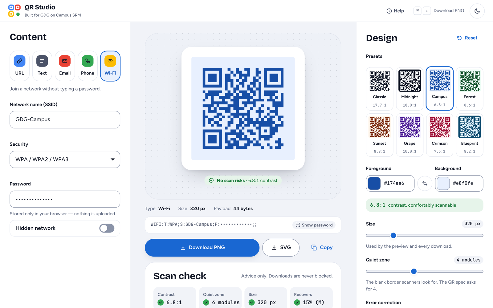
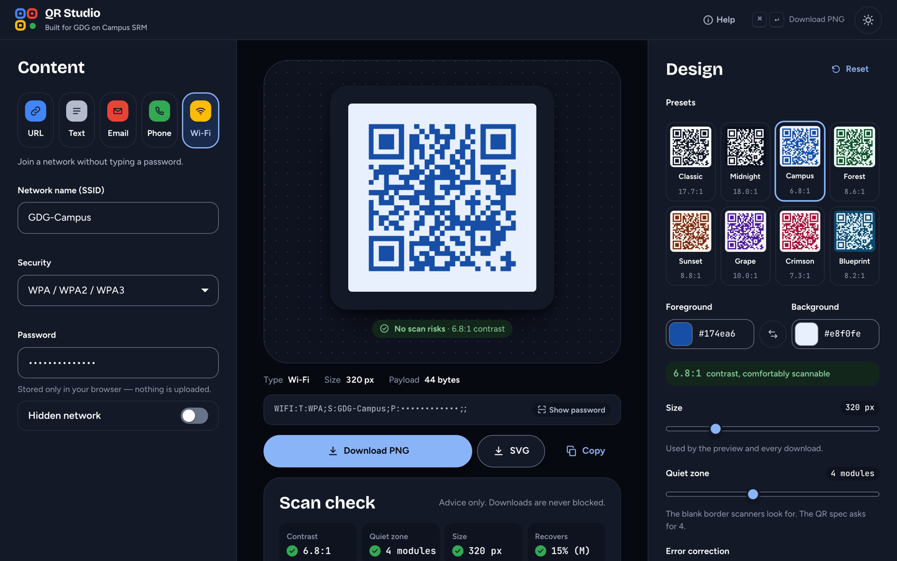
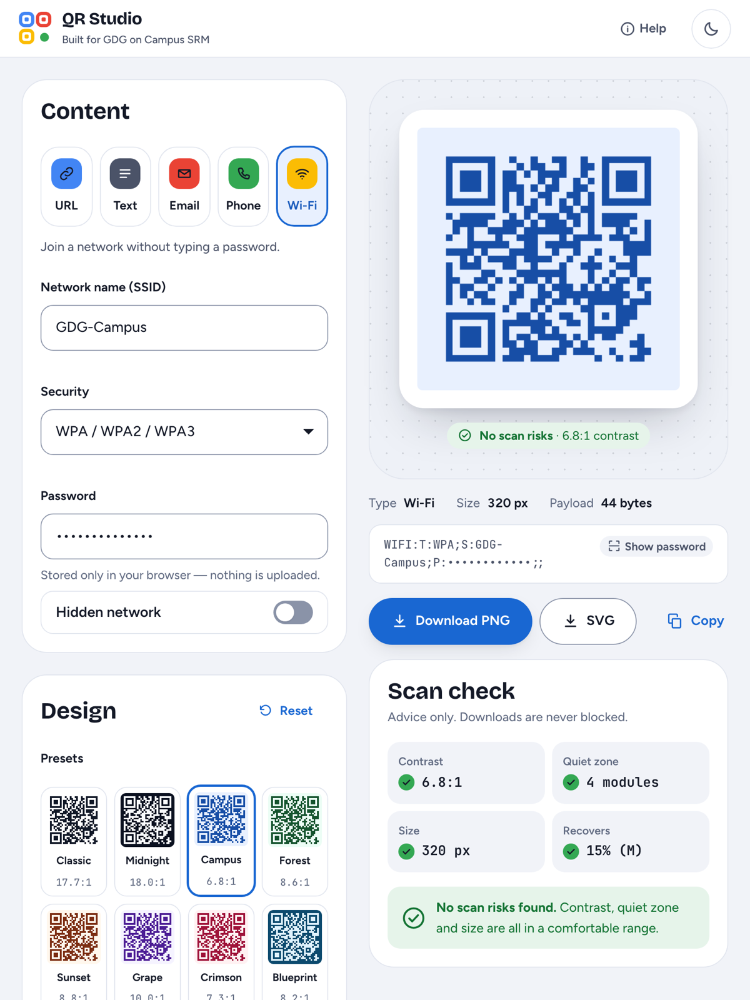
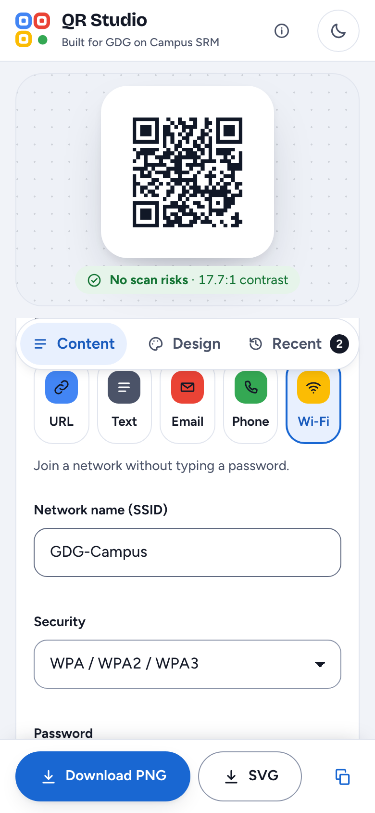

# QR Studio — QR Code Generator & Designer

**Live:** https://qr-studio-jagpreet-singh1.vercel.app

A browser-only QR code generator and designer built for the **GDG on Campus SRM Technical
Recruitment 2026** frontend task. Pick what the code should do, design it, check that it will
actually scan, and download it as PNG or SVG. There is no backend — every byte stays on the
device, which matters because one of the supported types is a Wi-Fi password.

---

## Overview

Most QR tools stop at "here is a black square". QR Studio focuses on the two things that
actually go wrong in practice:

1. **The payload has to be correct.** A `tel:` code with spaces in it, a Wi-Fi code with an
   unescaped `;` in the password, or a URL missing its scheme all produce a code that scans but
   does the wrong thing. Each type is validated and encoded to its real specification.
2. **The design has to stay scannable.** Low contrast, a missing quiet zone, or an oversized
   logo will break a code. QR Studio measures these and warns you — without ever blocking you.

---

## Features

### Five QR types with a form that adapts
| Type | Encoded as | Notes |
| --- | --- | --- |
| URL | `https://example.com` | `https://` is added when the scheme is missing |
| Plain text | raw text | any UTF-8 content |
| Email | `mailto:a@b.com?subject=…&body=…` | subject and body are percent-encoded (spaces as `%20`, not `+`) |
| Phone | `tel:+919876543210` | spaces, dashes and brackets are stripped |
| Wi-Fi | `WIFI:T:WPA;S:ssid;P:pass;H:true;;` | `\ ; , : "` are escaped per the Wi-Fi payload grammar |

Each type keeps its own draft, so switching between types never loses what you typed.

### Real-time generation
The preview re-renders on every valid keystroke or setting change. What you see is exactly what
downloads — the PNG is exported from the very canvas element shown on screen.

### Customisation
Size (128–1024 px), foreground and background colour (picker **or** hex entry), error correction
level (L/M/Q/H), and quiet-zone margin (0–10 modules). A swap button flips the two colours.

### Presets
Eight visual presets (Classic, Midnight, Campus, Forest, Sunset, Grape, Crimson, Blueprint).
A preset only sets colours and margin, so your size, error-correction level and logo survive it,
and every control stays editable afterwards. The active preset is highlighted by comparing the
current style, so it de-selects itself as soon as you change a colour.

### Scan-reliability advisor
Warnings appear when settings are risky, and downloads stay enabled regardless:

- WCAG contrast below 4.5:1 (and a stronger warning below 3:1)
- inverted codes (light modules on a dark background)
- a quiet zone smaller than the 4 modules the specification asks for
- output smaller than 200 px
- a logo with error correction below Q, or a logo covering more than 25% of the code
- payloads dense enough that the modules get very small

When nothing is wrong, it says so instead of staying silent.

### Downloads
**PNG** at the exact configured pixel size, and **SVG** built from the same geometry for
lossless printing. Files are named from the content, e.g. `qr-url-gdg-community-dev.png`.

### Recent codes
Generated codes are saved to `localStorage` with a thumbnail and survive a refresh. Selecting one
restores both its data *and* its full customisation. Entries are keyed by their encoded payload,
so re-styling the same content updates that entry instead of filling the list with near-duplicates.
Individual entries can be removed, or the list cleared.

### Optional extras (built after the mandatory scope)
- SVG download
- Centre logo with an automatic background plate and an aspect-ratio-preserving fit
- Light/dark theme that follows the system preference and remembers your choice

---

## Tech stack

| Layer | Choice | Why |
| --- | --- | --- |
| Framework | React 19 + TypeScript | required by the task |
| Build | Vite 8 | fast dev server, static output Vercel deploys as-is |
| QR encoding | [`qrcode`](https://www.npmjs.com/package/qrcode) | only its `create()` matrix API is used; all drawing is ours |
| Styling | Hand-written CSS with custom properties | Tailwind was not already configured, and one token layer drives both themes |
| Storage | `localStorage` | no backend, per the brief |

`qrcode` and `react`/`react-dom` are the only runtime dependencies.

---

## Setup

```bash
git clone <your-fork-url>
cd QR
npm install
npm run dev      # http://localhost:5173
```

Other scripts:

```bash
npm run build    # type-check (tsc -b) then build to dist/
npm run preview  # serve the production build locally
npm run lint     # oxlint
```

Requires Node 20.19+ or 22.12+ (Vite 8).

### Deploying to Vercel

The repo is deploy-ready: [`vercel.json`](vercel.json) pins the Vite framework preset, the build
command and `dist` as the output directory, adds an SPA rewrite and sets immutable caching for
hashed assets.

```bash
npx vercel        # preview deployment
npx vercel --prod # production
```

Or import the repository in the Vercel dashboard — no environment variables are needed.

This project is already deployed to production at the URL above. Note that Vercel enables
**Deployment Protection** on new projects, which puts a Vercel login in front of the site; turn it
off under *Project → Settings → Deployment Protection* for the link to be publicly shareable.

---

## Usage

1. **Pick a type** — URL, Text, Email, Phone or Wi-Fi. The form changes to match.
2. **Fill in the details.** Errors appear inline under the field they belong to.
3. **Choose a preset** as a starting point (optional).
4. **Customise** colours, size, margin, error correction and an optional centre logo.
5. **Read the advisory panel** under the preview if anything might affect scanning.
6. **Download** as PNG or SVG.
7. **Reopen anything** from *Recent codes* — data and design come back together.

---

## Screenshots

| Desktop — light | Desktop — dark |
| --- | --- |
|  |  |

| Tablet | Mobile |
| --- | --- |
|  |  |

---

## Testing notes

Verification was done in a real Chromium browser (Playwright) against the dev server, decoding the
rendered canvas pixels with a QR decoder (`jsQR`) so "it scans" is proven rather than assumed —
52 automated checks covering:

- **All five types** — each payload is decoded back from the canvas and compared to the expected
  string, including Wi-Fi `H:true` and the open-network case that must omit the password.
- **Validation** — empty and malformed input for every type shows the right message, the download
  button disables, and the preview hides.
- **Customisation** — a canvas colour census proves only the two chosen colours are painted, the
  canvas is exactly the configured pixel size, and the code still decodes afterwards.
- **Presets** — applying one changes colours, keeps the custom size, and stays editable.
- **Scan warnings** — a low-contrast pair raises a warning while the download stays enabled.
- **Downloads** — the PNG's signature and IHDR dimensions are checked, and the downloaded file is
  decoded back to the original URL. The SVG is checked for the preview's colours and dimensions.
- **Logo** — the centre pixel matches the uploaded image, the code still decodes at ECC H, and the
  SVG embeds an `<image>`.
- **Oversized payload** — a 2000-character string surfaces the "too long" message and re-enables
  itself once shortened.
- **History** — entries are captured, survive a reload, restore both data and customisation, and
  can be removed.
- **Theme** — toggles and persists across a reload.
- **Responsive** — no horizontal overflow at 375 px, 834 px or 1440 px.
- **No console errors** during the entire run.

That suite caught a real stacking bug: the pinned preview column was being painted over by the
positioned history thumbnails, which is now fixed with an explicit `z-index`.

### Manual checks worth repeating

Scan a downloaded PNG with a phone camera, especially after lowering contrast or the margin — the
advisory text is calibrated for real cameras, not just decoders.

---

## Important design decisions

**One geometry, three outputs.** `src/lib/render.ts` computes module boundaries once with
`Math.round((i * pixels) / count)` and both the canvas and the SVG walk the same edges. Rounding
shared edges (rather than using a fractional cell width) avoids hairline seams between modules and
makes the image land on the exact requested pixel size. The PNG download is taken straight from
the preview canvas, so "the download matches the preview" is structural, not a promise.

**Content is a discriminated union.** `QrContent` is a union keyed on `type`, and drafts are held
as a mapped type `{ [T in QrType]: ContentOf<T> }`. Encoding and validation both `switch` on the
tag, so adding a sixth type is a compile error everywhere it needs handling — no stringly-typed
field bags.

**Business logic lives outside React.** `lib/` holds pure, testable functions — encoding,
validation, contrast maths, scan advice, rendering, persistence. Components render; hooks
(`useQrCanvas`, `useHistory`, `useTheme`, `useDebouncedValue`) bridge the two.

**Warn, never block.** A low-contrast code is a valid choice for a screen-only design. The advisor
explains the risk and quantifies it (`2.1:1`), and the download button stays enabled. The only
thing that genuinely disables downloading is a payload that cannot be encoded at all.

**History keyed by payload, written on settle.** Writing on every keystroke would flood the list.
A 900 ms debounce plus payload-keyed upsert means "type a URL, tweak the colours" produces one
entry that ends up holding the final design.

**Defensive persistence.** Anything read back from `localStorage` is re-validated field by field
before use, unknown shapes are dropped, and a `QuotaExceededError` retries with progressively
fewer entries instead of throwing. Reads and writes are wrapped so private-mode browsers degrade
to a working app without history rather than a blank screen.

**CSS custom properties over a utility framework.** Tailwind was not already configured, and
adding it would have meant a build-tooling dependency for a single-page app. One token block plus
a `[data-theme='dark']` override gives both themes; layout uses `display: contents` on the column
wrappers so the same markup orders the preview directly under the form on mobile and beside it on
desktop.

**Accessibility.** Type and error-correction pickers are real radio groups, every field is
label-linked with `aria-describedby` pointing at its error or hint, errors use `role="alert"`,
icon-only buttons carry `aria-label`, and `prefers-reduced-motion` is respected.

---

## Project structure

```
src/
  types.ts                  Domain types (QrContent union, QrStyle, HistoryEntry)
  lib/
    qrContent.ts            Per-type metadata, drafts, normalisation, payload encoding
    validation.ts           Per-type field validation
    colour.ts               Hex parsing, WCAG luminance and contrast
    scanAdvice.ts           Scan-reliability warnings
    render.ts               Shared geometry -> canvas, PNG and SVG
    presets.ts              Visual presets, default style, preset matching
    storage.ts              Quota-safe, schema-validated localStorage
    download.ts             Blob/data-URL download + filename slugging
  hooks/
    useQrCanvas.ts          Async canvas rendering with stale-run cancellation
    useHistory.ts           Recent-codes state, keyed upsert, persistence
    useTheme.ts             Theme state + <html data-theme>
    useDebouncedValue.ts    Generic debounce
  components/               TypeSelector, ContentForm, fields, ColourField, StyleControls,
                            PresetPicker, LogoControl, QrPreview, HistoryPanel, Callout, Icon
  App.tsx                   Composition and wiring
  index.css                 Tokens, base styles, component styles
```

---

## Known limitations

- The logo is limited to 256 KB because it is stored in `localStorage` as a data URL alongside the
  history entry; larger images would exhaust the quota.
- History holds the 12 most recent codes, trimming further if the browser quota is hit.
- Modules are drawn as squares — no rounded or custom module shapes.
- Codes are generated, not read: there is no camera-based scanner in the app.
