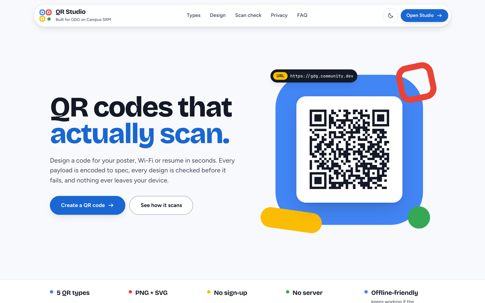

# QR Studio

**QR codes that actually scan, designed in seconds, nothing leaves your device.**

**Live:** https://qr-studio-jagpreet-singh1.vercel.app · **Studio:** https://qr-studio-jagpreet-singh1.vercel.app/studio

Built for **GDG on Campus SRM** — Technical Recruitment 2026-27, Frontend Task 1 (QR Code Generator & Designer).



---

## What it is

QR Studio is a browser-only QR code generator and designer. It has two routes:

- **`/` — the landing page.** Explains the product by demonstrating it: a live hero code that
  morphs between payloads, a types showcase that prints the exact encoded string, a scan-check
  demo driven by the real advisor, and a privacy explainer.
- **`/studio` — the tool.** Pick a type, fill it in, design it, read the scan check, download.

There is no backend. Every payload is encoded and every image is rendered in the tab, which
matters because one of the types carries a Wi-Fi password.

## Features

### The required scope

| Requirement | How QR Studio handles it |
| --- | --- |
| 5 QR types | URL, Text, Email, Phone, Wi-Fi, each with its own draft so switching never loses input |
| Live preview | Re-renders on every valid change; the preview canvas is the PNG you download |
| Customisation | Size (128–1024 px), foreground/background (picker or hex, swap), error correction L/M/Q/H, quiet zone 0–10 modules |
| Presets | 8 presets that render the *actual* code in each palette; everything stays editable afterwards |
| PNG download | Exported from the preview canvas itself, so it matches pixel for pixel |
| Validation | Per-type, plain-language messages that replace the hint in place (no layout jump) |
| Scan reliability | Measured readings (WCAG contrast, quiet zone, size, recovery) plus severity-ranked advice; warns, never blocks |
| Recent codes | Saved to `localStorage`, survive refresh, restore content **and** design; remove/clear with undo |
| Responsive | Desktop three-column workspace, tablet two-column, mobile with a pinned preview and sticky export bar |
| Testing | 91 automated browser checks, committed (`npm run test:e2e`) |
| Deployment | Vercel |

### Correct payloads, shown not told

| Type | Encoded as |
| --- | --- |
| URL | `https://…` (scheme added when missing, otherwise many scanners show plain text) |
| Email | `mailto:a@b.com?subject=Hello%20GDG` (`%20`, not `+`) |
| Phone | `tel:+919876543210` (spaces and brackets stripped) |
| Wi-Fi | `WIFI:T:WPA;S:GDG-Campus;P:build\;with\;gdg;;` (`\ ; , : "` escaped) |

### Extras

- **SVG download** built from the same geometry as the canvas.
- **Copy image** to the clipboard, falling back to copying the encoded text where image copy is unsupported.
- **Centre logo** by click or drag-and-drop, with an automatic background plate.
- **Light and dark themes** that follow the system and remember the choice, applied before first paint.
- **Keyboard:** ⌘/Ctrl + Enter downloads the PNG; type and error-correction pickers are radio groups with arrow keys.
- **Privacy details:** the Wi-Fi password is masked in the payload readout (reveal on request), the
  canvas label never contains the payload, and payloads are never put in the URL.

## Screenshots

| Studio — light | Studio — dark |
| --- | --- |
|  |  |

| Tablet | Mobile | Landing — mobile, dark |
| --- | --- | --- |
|  |  |  |

Full landing page: [docs/landing-full.png](docs/landing-full.png). Regenerate all of them with
`node tests/screenshots.mjs` against a running build.

---

## How this was designed

The previous version worked but looked generic, so the redesign started from evidence rather
than taste. The full record is in [docs/design-brief.md](docs/design-brief.md).

1. **Critique of the old UI** with the Impeccable design skill, run as two isolated reviews (a
   heuristic design review and a mechanical detector). It scored 24/40 and named three P1s: the
   preview disappeared on mobile, the scan advisor was buried, and the look could belong to any
   product. Each of those has a specific answer in the new design.
2. **Product truth first:** Impeccable `init` produced [PRODUCT.md](PRODUCT.md) (users, positioning,
   constraints, what must never be claimed).
3. **Direction rounds:** Impeccable dealt competing visual directions on a decision page. After two
   bolder re-rolls and a steered hand, the direction chosen from the safer register was
   **Expressive Google-native product**: Bricolage Grotesque, Figtree and JetBrains Mono, a cool
   neutral scale with GDG blue leading and red, yellow and green used for meaning, our own mark
   built from QR finder patterns (no GDG or Google logo is used), and the live code staged as the
   hero object.
4. **Figma first:** the token system, a component library and the key screens were built in Figma
   through the Figma MCP — [design file](https://www.figma.com/design/ReC7bi5MHPI7umlpCt3OZM).
   Tokens live in [`design/tokens.mjs`](design/tokens.mjs); `npm run tokens` writes
   `src/styles/tokens.css`, and the scripts in `design/` generated the Figma variables, components
   and screens from the same source, so `color/bg` in Figma is `--color-bg` in CSS.
5. **Build, then audit:** Lighthouse, a measured contrast pass, the detector, and a second
   two-reviewer critique of the finished pages drove the fixes listed in the commit history.

## Quality

Lighthouse, mobile profile, production build:

| Route | Performance | Accessibility | Best practices | SEO |
| --- | --- | --- | --- | --- |
| `/` | 95 | 100 | 100 | 100 |
| `/studio` | 95 | 100 | 100 | 100 |

- **Accessibility:** WCAG 2.2 AA contrast in both themes (token pairs measured, not eyeballed),
  skip link, landmarks, one `h1` per route, radio groups and tabs with full keyboard support,
  `aria-live` for toasts, validation and the scan check, `prefers-reduced-motion` honoured everywhere.
- **Motion:** one authored moment per surface (the hero code assembling and morphing; the studio
  preview reacting), shared duration and easing tokens, nothing that delays interaction.
- **Bundle:** before the redesign the app shipped one 278 kB JS chunk (89 kB gzipped). Now the
  landing page's initial JS is about 267 kB (87 kB gzipped) despite the added page; the studio
  (33 kB), the below-the-fold sections and Motion's feature bundle load lazily, and the studio is
  prefetched when the browser is idle so it opens instantly and keeps working if the connection drops.

## Testing

```bash
npm run test:e2e        # builds, serves dist/ with vite preview, runs 91 checks in Chromium
E2E_URL=https://qr-studio-jagpreet-singh1.vercel.app node tests/e2e.mjs   # test any running site
```

[`tests/e2e.mjs`](tests/e2e.mjs) decodes rendered canvases and downloaded files with `jsQR`, so
"it scans" is proven rather than assumed. It covers:

- all five types (including Wi-Fi escaping, the hidden flag and open networks), payload masking;
- validation for every type, disabled downloads and the empty state;
- customisation (a colour census proves only the two chosen colours are painted), presets,
  reset with undo, low-contrast warnings that never block;
- PNG signature, dimensions and decodability of the downloaded file; SVG colours and size;
  clipboard copy; the ⌘/Ctrl + Enter shortcut;
- logo upload, centre pixel, decodability at ECC H, SVG embedding;
- oversized payloads and recovery;
- recent codes: capture, reload persistence, restoring data and design, remove/clear with undo;
- theme toggle and persistence; landing hero and showcase codes decode; keyboard support;
- no horizontal overflow at 375, 834 and 1440 px in both themes; mobile export bar and preview
  reachable on the first screen; no console errors.

## Tech stack

| Layer | Choice |
| --- | --- |
| Framework | React 19 + TypeScript (strict-ish: `noUnusedLocals`, `verbatimModuleSyntax`, `erasableSyntaxOnly`) |
| Build | Vite 8 |
| QR encoding | [`qrcode`](https://www.npmjs.com/package/qrcode) — only its module matrix is used; all drawing is ours |
| Motion | [`motion`](https://motion.dev) via `LazyMotion` + `m`, features loaded lazily |
| Fonts | Self-hosted variable fonts via Fontsource (no render-blocking font request) |
| Styling | Hand-written CSS on generated custom-property tokens |
| Routing | A ~50-line History-API router (`src/router.ts`, `src/Link.tsx`) |
| Testing | Playwright + jsQR (dev only) |

## Setup

```bash
npm install
npm run dev        # http://localhost:5173
npm run build      # type-check, then build to dist/
npm run lint       # oxlint
npm run test:e2e   # end-to-end checks
```

Requires Node 20.19+ or 22.12+.

### Deploying

[`vercel.json`](vercel.json) sets the Vite preset, rewrites every path to `index.html` (so
`/studio` deep-links) and caches hashed assets immutably. `npx vercel` deploys a preview,
`npx vercel --prod` promotes to production. **Vercel enables Deployment Protection on new projects;
turn it off under Project → Settings → Deployment Protection for the link to be public.**

## Project structure

```
design/                 Token source + generators for tokens.css and the Figma file
docs/                   Design brief and screenshots
src/
  types.ts              Domain types (QrContent union, QrStyle, HistoryEntry)
  lib/                  Pure logic: encoding, validation, contrast, scan advice, rendering, storage
  hooks/                useQrCanvas, useHistory, useTheme, useDebouncedValue, useRovingRadio
  components/           Shared UI: fields, ColourField, ContentForm, Icon, QrSvg, MorphingCode, brand/
  landing/              Landing page: Hero, TrustStrip, sections/ (lazy below the fold)
  studio/               Studio: Stage, ExportBar, ScanCheck, DesignPanel, LogoDrop, RecentCodes, Toast
  styles/               tokens.css (generated), base.css, ui.css, landing.css, studio.css
  router.ts, Link.tsx   Two-route History-API router
tests/                  e2e.mjs, screenshots.mjs, og-image.mjs
```

## Important design decisions

- **One geometry, three outputs.** `src/lib/render.ts` computes module edges once; the canvas and
  the SVG walk the same edges, and the PNG is exported from the preview canvas.
- **Content is a discriminated union.** Encoding and validation `switch` on the type tag, so adding a
  type is a compile error everywhere it needs handling.
- **Warn, never block.** The only thing that disables download is a payload that cannot be encoded.
- **Privacy by construction.** No server, no payloads in URLs, passwords masked on screen.
- **Logic stays out of the UI.** The redesign replaced every component but did not change the
  behaviour of `src/lib` or `src/hooks` (one additive helper, `moduleGrid`, powers the morphing
  codes; `useHistory` gained an additive `restore` for undo).

## Known limitations

- **Figma plan limits.** The Starter plan allows one mode per variable collection and three pages
  per file, so light and dark live in paired `Theme/Light` and `Theme/Dark` collections with
  identical variable names, and the file has three pages (Foundations, Components, Screens). The
  four `code-*` tokens added during the Lighthouse pass are in `design/tokens.mjs` and
  `tokens.css` but were not pushed to Figma, to conserve the View seat's small monthly MCP quota.
- **Detector coverage.** Impeccable's detector ran in its regex fallback mode (its HTML/CSS parser
  modules were not installed), so contrast was measured separately rather than by the detector.
- Logos are limited to 256 KB (stored as data URLs with each history entry); history keeps 12 codes.
- Modules are square; there are no gradient or custom module shapes.
- QR Studio generates codes; it does not read them with a camera.

---

Independent project. Not affiliated with or endorsed by Google.
